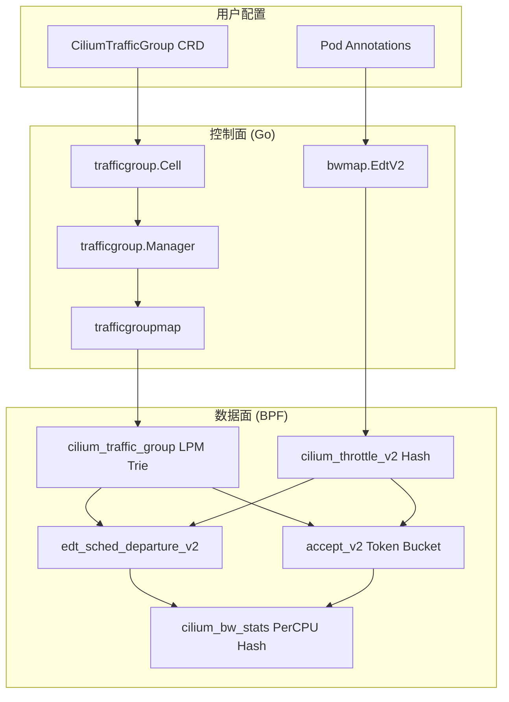

# 基于 CIDR 的流量分类限速功能 - 代码解析

本文档详细解析了 Cilium 中实现基于 CIDR 的流量分类限速功能的所有代码组件。

---

## 架构概览



---

## 1. BPF 数据面

### 1.1 流量组 LPM Map

[traffic_group.h](file:///Users/wangxingxing/Documents/projetcs/cilium/bpf/lib/traffic_group.h)

```c
// Key 结构 - 用于 LPM 最长前缀匹配
struct traffic_group_key {
    struct bpf_lpm_trie_key lpm_key;  // 前缀长度
    __u16 pad0;
    __u8  pad1;
    __u8  family;      // IPv4/IPv6
    union {
        __be32 ip4;
        union v6addr ip6;
    };
};

// Value 结构
struct traffic_group_value {
    __u16 group_id;    // 流量组 ID (1-65535)
};
```

**查询函数**：
- `lookup_traffic_group4(dest_ip)` - IPv4 目标地址查询
- `lookup_traffic_group6(dest_ip)` - IPv6 目标地址查询

### 1.2 带宽统计 Map

[bw_stats.h](file:///Users/wangxingxing/Documents/projetcs/cilium/bpf/lib/bw_stats.h)

```c
struct bw_stats_key {
    __u32 endpoint_id;  // Pod 端点 ID
    __u16 group_id;     // 流量组 ID
    __u8  direction;    // 0=egress, 1=ingress
};

struct bw_stats_value {
    __u64 bytes;        // 累计字节数
    __u64 packets;      // 累计包数
};
```

**更新函数**：`update_bw_stats(ep_id, group_id, direction, bytes)`

### 1.3 EDT v2 限速

[edt.h](file:///Users/wangxingxing/Documents/projetcs/cilium/bpf/lib/edt.h)

```c
// v2 Key - 增加了 group_id
struct edt_id_v2 {
    __u32 endpoint_id;
    __u16 group_id;
    __u8  direction;
};

// 出流量限速函数
int edt_sched_departure_v2(ctx, proto, endpoint_id, group_id)
```

**算法**：Earliest Departure Time (EDT)
- 计算每个包的理论发送时间
- 超过时间阈值则丢包

### 1.4 入流量 Token Bucket

[token_bucket.h](file:///Users/wangxingxing/Documents/projetcs/cilium/bpf/lib/token_bucket.h)

```c
// 入流量限速函数
int accept_v2(ctx, ep_id, group_id)
```

**算法**：Token Bucket
- 按速率补充令牌
- 包大小超过可用令牌则丢包

### 1.5 集成点

| 文件 | 位置 | 功能 |
|------|------|------|
| [bpf_host.c](file:///Users/wangxingxing/Documents/projetcs/cilium/bpf/bpf_host.c#L1450-L1490) | `__section_tail_call_ipv4_from_lxc` | 出流量: 查询 group → EDT v2 |
| [local_delivery.h](file:///Users/wangxingxing/Documents/projetcs/cilium/bpf/lib/local_delivery.h#L134-L155) | `local_delivery()` | 入流量: 查询 group → Token Bucket v2 |

---

## 2. 控制面 CRD

### 2.1 CiliumTrafficGroup 类型定义

[trafficgroup_types.go](file:///Users/wangxingxing/Documents/projetcs/cilium/pkg/k8s/apis/cilium.io/v2alpha1/trafficgroup_types.go)

```go
type CiliumTrafficGroup struct {
    metav1.TypeMeta
    metav1.ObjectMeta
    Spec CiliumTrafficGroupSpec
}

type CiliumTrafficGroupSpec struct {
    ID    uint16      // 唯一 ID (1-65535)
    CIDRs []api.CIDR  // CIDR 列表
}
```

**示例 YAML**：
```yaml
apiVersion: cilium.io/v2alpha1
kind: CiliumTrafficGroup
metadata:
  name: internal-traffic
spec:
  id: 1
  cidrs:
    - "10.0.0.0/8"
    - "192.168.0.0/16"
```

---

## 3. 控制面业务逻辑

### 3.1 Manager

[manager.go](file:///Users/wangxingxing/Documents/projetcs/cilium/pkg/trafficgroup/manager.go)

```go
type Manager struct {
    groups   map[string]*CiliumTrafficGroup  // name -> CRD
    idToName map[uint16]string               // id -> name
    tgMap    trafficgroupmap.TrafficGroupMap // BPF Map
}
```

**核心方法**：

| 方法 | 触发 | 功能 |
|------|------|------|
| `OnAdd(tg)` | CRD 创建 | 校验 ID 冲突 → 存储 → 同步 BPF |
| `OnUpdate(old, new)` | CRD 更新 | 删除旧 CIDR → 插入新 CIDR |
| `OnDelete(tg)` | CRD 删除 | 从 BPF Map 删除所有 CIDR |
| `GetGroupID(name)` | 内部查询 | 名称 → ID |
| `GetGroupName(id)` | Metrics | ID → 名称 |

### 3.2 Informer 集成

[cell.go](file:///Users/wangxingxing/Documents/projetcs/cilium/pkg/trafficgroup/cell.go)

```go
var Cell = cell.Module(
    "trafficgroup",
    "Traffic Group Manager",
    cell.Provide(newTrafficGroupResource),
    cell.Invoke(registerInformer),
)
```

**事件处理流程**：
```
K8s API → Informer → resource.Events() → Manager.OnAdd/OnUpdate/OnDelete
```

---

## 4. BPF Map Go 封装

### 4.1 TrafficGroupMap

[trafficgroupmap.go](file:///Users/wangxingxing/Documents/projetcs/cilium/pkg/maps/trafficgroupmap/trafficgroupmap.go)

```go
type TrafficGroupMap interface {
    InsertCIDR(cidr *net.IPNet, groupID uint16) error
    DeleteCIDR(cidr *net.IPNet) error
    LookupCIDR(cidr *net.IPNet) (uint16, error)
}
```

**Key 结构**：必须与 BPF 侧 `traffic_group_key` 内存对齐。

### 4.2 BwStatsMap

[bwstatsmap.go](file:///Users/wangxingxing/Documents/projetcs/cilium/pkg/maps/bwstatsmap/bwstatsmap.go)

```go
type BwStatsMap interface {
    IterateWithCallback(IterateCallback) error
}
```

**用途**：收集 PerCPU 统计数据，聚合后导出 Prometheus。

### 4.3 EdtV2 (StateDB)

[table.go](file:///Users/wangxingxing/Documents/projetcs/cilium/pkg/maps/bwmap/table.go#L153-L295)

```go
type EdtV2 struct {
    EdtV2IDKey
    BytesPerSecond  uint64
    Prio            uint32
    TimeHorizonDrop uint64
    Status          reconciler.Status
}

type EdtV2IDKey struct {
    EndpointID uint16
    GroupID    uint16
    Direction  uint8
}
```

**StateDB Reconciler**：自动同步内存状态到 BPF Map。

---

## 5. Prometheus 监控

[stats.go](file:///Users/wangxingxing/Documents/projetcs/cilium/pkg/datapath/linux/bandwidth/stats.go)

```go
var bandwidthBytesTotal = prometheus.NewCounterVec(
    prometheus.CounterOpts{
        Namespace: "cilium",
        Subsystem: "bw",
        Name:      "bytes_total",
    },
    []string{"endpoint", "group", "direction"},
)
```

**指标示例**：
```
cilium_bw_bytes_total{endpoint="1234", group="internal", direction="egress"} 1048576
```

---

## 6. 数据流图

### 出流量 (Egress)

```
Pod 发送数据 → bpf_host.c
    ↓
解析目标 IP → lookup_traffic_group4(daddr)
    ↓
group_id > 0 ? → edt_sched_departure_v2(ep_id, group_id)
    ↓              ↓
设置 tstamp      update_bw_stats(ep_id, group_id, EGRESS, bytes)
    ↓
转发/丢包
```

### 入流量 (Ingress)

```
数据到达 Pod → local_delivery.h
    ↓
解析源 IP → lookup_traffic_group4(saddr)
    ↓
group_id > 0 ? → accept_v2(ep_id, group_id)
    ↓              ↓
Token Bucket   update_bw_stats(ep_id, group_id, INGRESS, bytes)
    ↓
接收/丢包
```

---

## 7. 使用示例

### 步骤 1: 创建流量组

```yaml
apiVersion: cilium.io/v2alpha1
kind: CiliumTrafficGroup
metadata:
  name: public-cloud
spec:
  id: 2
  cidrs:
    - "0.0.0.0/0"  # 兜底规则
---
apiVersion: cilium.io/v2alpha1
kind: CiliumTrafficGroup
metadata:
  name: internal
spec:
  id: 1
  cidrs:
    - "10.0.0.0/8"
    - "172.16.0.0/12"
```

### 步骤 2: Pod 注解限速

```yaml
apiVersion: v1
kind: Pod
metadata:
  name: my-app
  annotations:
    bandwidth.cilium.io/egress-internal: "100M"      # 内网出口 100MB/s
    bandwidth.cilium.io/egress-public-cloud: "10M"   # 公网出口 10MB/s
    bandwidth.cilium.io/ingress-internal: "200M"     # 内网入口 200MB/s
spec:
  containers:
    - name: app
      image: nginx
```

---

## 8. 文件索引

| 层级 | 文件 | 功能 |
|------|------|------|
| BPF | `bpf/lib/traffic_group.h` | LPM Map + 查询函数 |
| BPF | `bpf/lib/bw_stats.h` | 统计 Map + 更新函数 |
| BPF | `bpf/lib/edt.h` | EDT v2 结构 + 限速函数 |
| BPF | `bpf/lib/token_bucket.h` | Token Bucket v2 函数 |
| BPF | `bpf/bpf_host.c` | 出流量集成 |
| BPF | `bpf/lib/local_delivery.h` | 入流量集成 |
| Go | `pkg/k8s/.../trafficgroup_types.go` | CRD 类型定义 |
| Go | `pkg/trafficgroup/manager.go` | 生命周期管理 |
| Go | `pkg/trafficgroup/cell.go` | Hive/Informer 集成 |
| Go | `pkg/maps/trafficgroupmap/` | LPM Map 封装 |
| Go | `pkg/maps/bwstatsmap/` | Stats Map 封装 |
| Go | `pkg/maps/bwmap/table.go` | EdtV2 StateDB |
| Go | `pkg/annotation/bandwidth.go` | 注解解析 |
| Go | `pkg/datapath/.../stats.go` | Prometheus 指标 |
| Helm | `install/.../cilium-trafficgroup-crd.yaml` | CRD 部署模板 |
